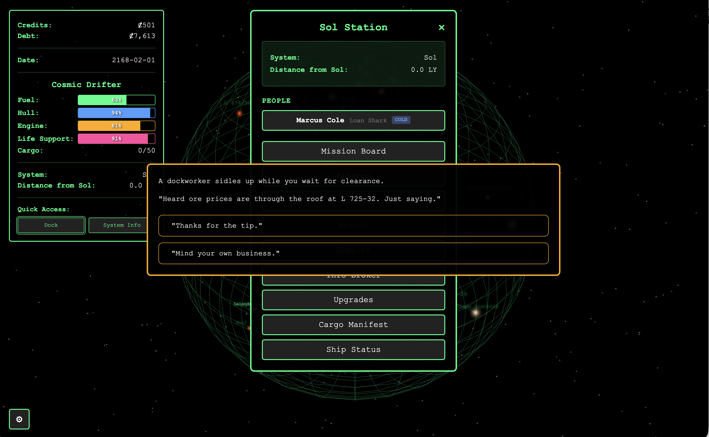

# Tramp Freighter Blues

**A full game, built entirely with AI — to find out where AI coding actually breaks.**

Tramp Freighter Blues is a space trading survival game: 117 real star systems, NPC relationships, pirate combat, branching dialogue, a multi-stage quest line, and 2,300+ passing tests. It was built first with [Kiro](https://kiro.dev/) and continued with[Claude Code](https://docs.anthropic.com/en/docs/claude-code).

It's not a polished product. It's alpha — minimal game balancing and rough edges. Perfect was never the point. The point was to push AI-assisted development as far as it goes and document where it fails.

What I found: four problems. I call them PAAD.



## PAAD: The Four Problems with AI Coding

**PAAD = Pushback · Alignment · Architecture · Degradation**

### Pushback

AI tends to agree with whatever you say. It doesn't push back, ask clarifying questions, or tell you your idea has problems. Systems that attempt this don't do it well.

**Status:** Largely solved. Specialized hooks and review workflows force the AI to challenge assumptions before writing code.

### Alignment

For larger tasks, AI "understands" the assignment — then implements most of it, plus things you didn't ask for. Scope creep from the machine.

**Status:** Largely solved. The same hook-based workflows keep implementation tightly scoped to what was actually requested.

### Architecture

AI is often bad at architecture. When a feature is hard to implement because the architecture is wrong, AI forces the feature through instead of recognizing the structural problem. It builds around bad foundations.

**Status:** Partially solved. Pausing between tasks to run specialized architectural review catches issues, but requires diligence and is still risky at scale.

### Degradation

A broad category. As software grows, complexity creates edge cases — security holes, subtle logic bugs, weird interactions. AI can't see these patterns. Humans struggle to articulate them clearly enough to teach AI what to watch for.

**Status:** Unsolved. This is the hard problem. Some promising work (like Anthropic's zero-day bug research) may help, but cost and scalability are open questions.

## The Game

The result of this experiment is a playable (if unbalanced) space trading survival game.

You're a broke freighter captain hauling cargo through wormhole networks, dodging pirates, bribing customs officials, and trying to keep your ship from falling apart. All you want to do is retire. Can you?

**What's in it:**

- 117 real star systems within 20 light-years of Sol, rendered in an interactive 3D starmap
- Commodity trading with dynamic prices, economic events, and information brokers
- Ship systems that degrade — fuel, hull, engines, life support — all need managing
- NPCs at stations who remember you and build relationships over time
- Pirate encounters, customs inspections, distress calls, mechanical failures
- A branching mission system with delivery, fetch, and passenger contracts
- A multi-stage quest line with an endgame sequence
- 2,300+ tests across 261 test files (as of this writing)

**What's not in it:** Game balance. This is alpha. Prices may be off, difficulty curves are untested, and some encounters are rougher than others. The goal was to build it, not perfect it.

## Try It

[Tramp Freighter Blues](https://curtispoe.org/paad/tramp-freighter/).

To run locally:

```bash
git clone https://github.com/Ovid/tramp-freighter/
cd tramp-freighter
npm install
npm run dev
```

Open `http://localhost:5173` in your browser.

## Technical Details

- **Stack:** React 18, Three.js, Vite
- **Platform:** Browser-based, no server required
- **Storage:** All saves in browser localStorage
- **Tests:** Vitest with property-based testing (fast-check)

## Contributing

This is a personal project, but feedback, bug reports, and collaboration are welcome! Please open an issue if you encounter problems or have suggestions.

## License

MIT License — see [LICENSE.md](LICENSE.md) for details.

---

_"The stars are far apart, but the people who live among them are closer than you think."_
